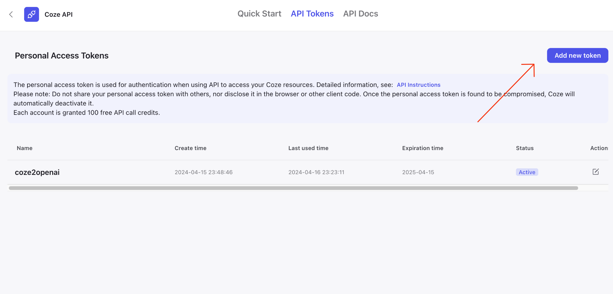
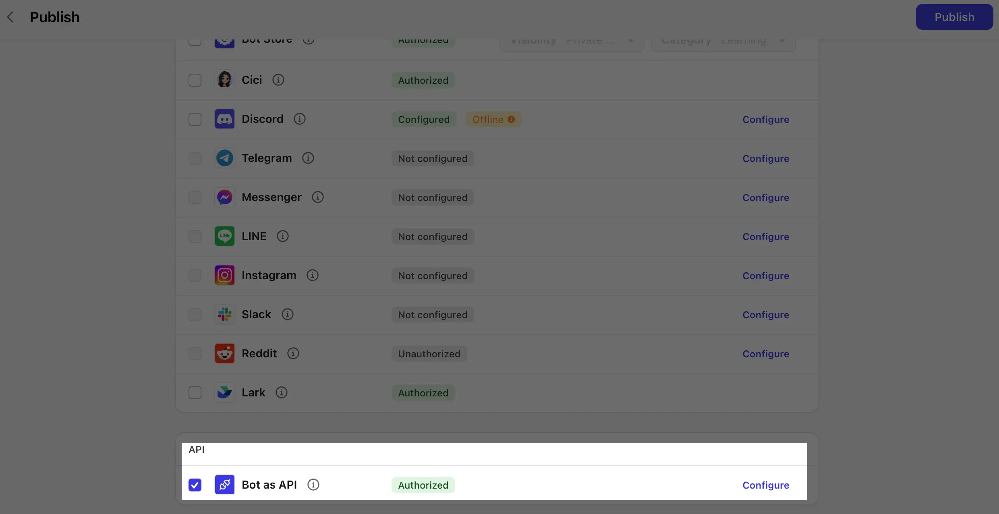
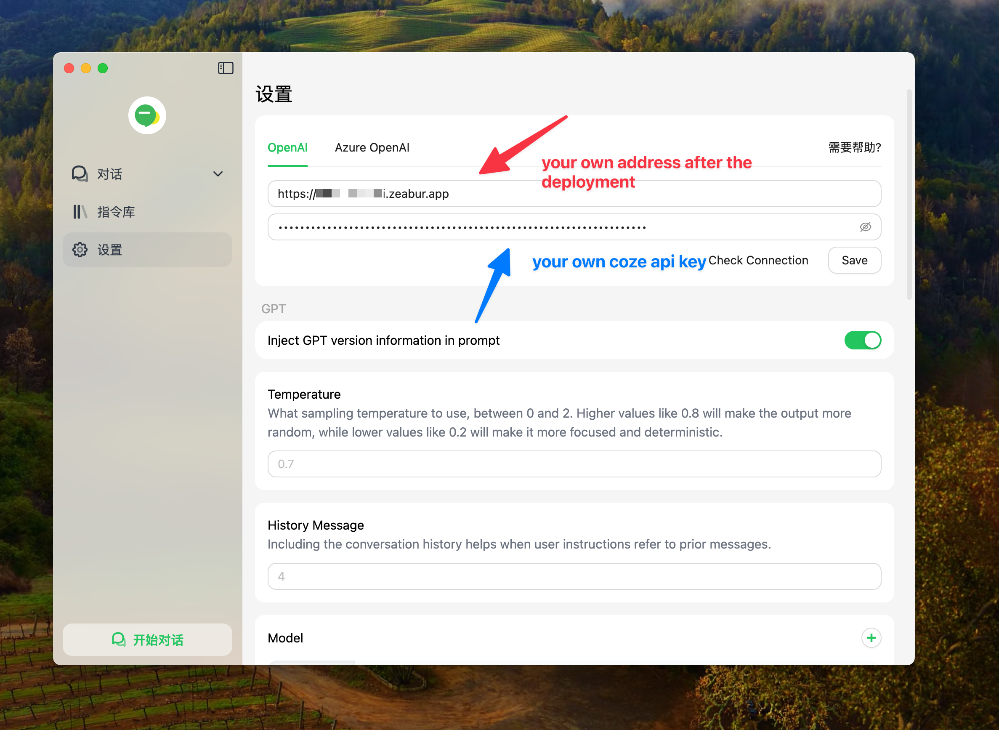

## C2O
**English** · [中文](README_CN.md) 

**Use Coze on your favorite OpenAI client.**

This project converts the Coze API to the OpenAI API format, giving you access to [Coze](https://www.coze.com) LLMs, knowledge base, plugins, and workflows within your preferred OpenAI clients. 

## Features
- Convert Coze API into an OpenAI API
- Support streaming and blocking
- Supports multi-bot switching

## Preparation
1. Register with [coze.com](https://www.coze.com) or [coze.cn](https://www.coze.cn)and obtain your API token


2. Create your bot and publish it to the API


3. Obtain the bot's ID,the number after the bot parameter, and configure it as an environment variable
```bash
https://www.coze.com/space/73428668341****/bot/73428668*****
```

## Deployment
### Zeabur
[](https://zeabur.com/templates/BZ515Z?referralCode=fatwang2)

### Vercel
[](https://vercel.com/new/clone?repository-url=https://github.com/fatwang2/coze2openai&env=BOT_ID&envDescription=COZE_BOT_ID)

**Note:** Vercel's serverless functions have a 10-second timeout limit.

### Railway
[](https://railway.app/template/yM5tQL?referralCode=mDim7U)


### Local Deployment
1. Set the environment variable on `.env` file
```bash
BOT_ID=xxxx
```

2. Install dependencies 
```bash
pnpm install
```

3. Run the project
```bash
pnpm start
```

## Usage
1. OpenAI Clients



2. Code

```JavaScript
const response = await fetch('http://localhost:3000/v1/chat/completions', {
  method: 'POST',
  headers: {
    'Content-Type': 'application/json',
    'Authorization': 'Bearer YOUR_COZE_API_KEY',
  },
  body: JSON.stringify({
    model: 'model_name',
    messages: [
      { role: 'system', content: 'You are a helpful assistant.' },
      { role: 'user', content: 'Hello, how are you?' },
    ],
  }),
});

const data = await response.json();
console.log(data);
```
## Environment Variable
This project provides some additional configuration items set with environment variables:

| Environment Variable | Required | Description                                                                                                                                                               | Example                                                                                                              |
| -------------------- | -------- | ------------------------------------------------------------------------------------------------------------------------------------------------------------------------- | -------------------------------------------------------------------------------------------------------------------- |
| `BOT_ID`     | Yes      | The ID of the bot. Obtain it from the Develop page URL of your bot in Coze. The number after the bot parameter is the bot ID.| `73428668*****`|
| `BOT_CONFIG`     | No      | Configure different models to correspond to different bot ids to enable fast bot switching on the client side. Models that are not included will request the default BOT_ID | `{"model_name_1": "bot_id_1", "model_name_2": "bot_id_2", "model_name_3": "bot_id_3"}`|
| `COZE_API_BASE`     | No      | Choose coze.com or coze.cn | `api.coze.com, api.coze.cn`|

## Roadmap
**Coming Soon**
*   Image support
*   Audio-to-text
*   Text-to-audio
*   Docker support

**Available Now**
*   Coze.cn
*   Multi-bot switching
*   Workflow, Plugins, Knowledge base
*   Continuous dialogue with the history of chat
*   Zeabur & Vercel & Railway deployment
*   Streaming & Blocking

## Contact
Feel free to reach out for any questions or feedback

[X](https://sum4all.site/twitter)\
[telegram](https://sum4all.site/telegram)

<a href="https://www.buymeacoffee.com/fatwang2" target="_blank"></a>

## License
This project is licensed under the MIT License.
